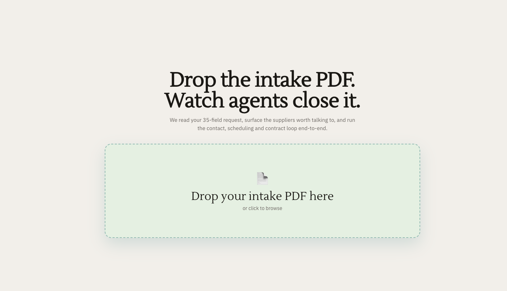

<div align="center">

# Crovi

**Drop the intake PDF. Watch agents close it.**

We read your 35-field request, surface the suppliers worth talking to, and run the contact, scheduling and contract loop end-to-end.



### ▶ [Watch the 2-minute demo](https://screen.studio/share/hLz14aMG)

PDF in → suppliers ranked → call placed → email sent → wire settled → meeting booked.

</div>

---

## What it does

You drop a research-procurement intake (PDF). Crovi parses the request, ranks suppliers from a live evidence pool, and runs a **five-stage agent cascade** to convert the lead into a signed allocation — without you in the loop.

```
┌─────────┐   ┌─────────┐   ┌─────────┐   ┌─────────┐   ┌─────────┐
│  FORM   │ → │  CALL   │ → │  EMAIL  │ → │ SMS_PAY │ ⇄ │ MEETING │
└─────────┘   └─────────┘   └─────────┘   └─────────┘   └─────────┘
     │             │             │             │             │
 Browser Use   AgentPhone    AgentMail       Sponge     Playwright
 fills the    outbound       filled intake   $1 USDC    headed
 supplier     voice agent    + benchmarked   settle on  Chromium
 intake form  (2 questions,  quote; reply    Solana +   books
 in headless  ≤ 20 s, hard   "I agree"       SMS        Notion
 Chromium     denoise)       cascades         receipt    calendar
```

The user never clicks **fire** on any stage. Each stage drives the next as soon as its terminal event lands.

## Pipeline at a glance

| Stage     | Owner                | Wire / artifact                       | Auto-advance trigger          |
| --------- | -------------------- | ------------------------------------- | ----------------------------- |
| Form      | Browser Use          | Supplier intake submitted             | `submit` complete or fallback |
| Call      | AgentPhone           | Outbound voice call (2 yes/no)        | terminal status or 60 s gate  |
| Email     | AgentMail            | Filled intake + quote sent            | reply matches *agree*         |
| SMS / Pay | AgentPhone + Sponge  | Solana USDC transfer + receipt SMS    | Sponge settle event           |
| Meeting   | Playwright           | Notion calendar event booked          | createEvent succeeds          |

Every boundary ships with a stub fallback, so a missing key or a 10DLC block degrades a stage without halting the chain.

## Architecture

```
┌──────────────────────────────────────────────────────────────────────┐
│  Browser (Next.js client)                                            │
│   ├─ Intake/Dropzone        — PDF upload                             │
│   ├─ Intake/ConfirmStrip    — 6 search-key chips                     │
│   ├─ Enrich/SupplierCards   — live conviction tiers (SSE)            │
│   ├─ Enrich/SessionPanel    — headless-Chromium mirror               │
│   └─ Output/Timeline        — chain events streaming                 │
└────────────────────────────────┬─────────────────────────────────────┘
                                 │
                       /api  (Next.js route handlers, runtime=node)
                                 │
┌──────────────────────────────────────────────────────────────────────┐
│  Server                                                              │
│   ├─ /api/intake            — Anthropic-driven PDF → 35-field form   │
│   ├─ /api/enrich/start      — fan out scrapes, broadcast to bus      │
│   ├─ /api/enrich/sessions/* — SSE: snapshots + JPEG frames           │
│   ├─ /api/chain/start       — run the 5-stage state machine          │
│   ├─ /api/chain/*/stream    — chain SSE feed                         │
│   └─ /api/webhooks/*        — agentmail + agentphone callbacks       │
└────────┬─────────────┬─────────────┬──────────────┬──────────────────┘
         │             │             │              │
   ┌─────▼────┐  ┌─────▼─────┐  ┌────▼────┐   ┌─────▼─────┐
   │ Browser  │  │ AgentPhone│  │AgentMail│   │  Sponge   │
   │   Use    │  │  voice+sms│  │  outbox │   │  USDC tx  │
   └──────────┘  └───────────┘  └─────────┘   └───────────┘

   plus: Moss (sub-200 ms turn retrieval) + Supermemory (long-term store)
         RefMed XLSX (14 k specimens) loaded at request time
```

## Stack

|                  |                                                                          |
| ---------------- | ------------------------------------------------------------------------ |
| **Frontend**     | Next.js 15 · React 19 · Server-Sent Events for live state                |
| **Voice / SMS**  | [AgentPhone](https://agentphone.ai) — outbound voice, SMS, iMessage      |
| **Email**        | [AgentMail](https://agentmail.to) — inbox, threading, webhook + poller   |
| **Browsing**     | [Browser Use](https://browser-use.com) + local Playwright Chromium       |
| **Payments**     | [Sponge](https://paysponge.com) — USDC on Solana, MCP-driven             |
| **Memory**       | [Moss](https://moss.dev) (fast turn retrieval) + [Supermemory](https://supermemory.ai) (long-term) |
| **LLM**          | Anthropic Claude (intake parsing, persona)                               |
| **Calendar**     | Playwright-driven Notion calendar (headed Chromium)                      |

## Run locally

```bash
# 1. install
npm install
npx playwright install chromium

# 2. configure
cp .env.example .env.local
# fill the keys you have — empty values fall back to stub-mode so the
# chain still demos end-to-end without every integration provisioned.

# 3. provision the AgentPhone voice agent (one-off)
WEBHOOK_BASE_URL=https://your-ngrok-host.ngrok.app npm run setup:agentphone
# paste the printed AGENT_ID / PHONE_NUMBER / WEBHOOK_SECRET into .env.local

# 4. dev server
npm run dev
# → http://localhost:3000 — drop an intake PDF and watch the cascade
```

## Project layout

```
app/                      Next.js App Router (pages + API routes)
components/
  Intake/                 PDF dropzone, confirm strip, 50-field accordion
  Enrich/                 Supplier grid + live session pane + detail pane
  Output/                 Chain timeline + climax / documents view
lib/
  agents/                 Intake parser, enrich orchestrator, chain runtime
  integrations/           AgentPhone, AgentMail, Browser Use, Sponge, Moss
  search/                 RefMed XLSX loader + evidence pool projection
scripts/                  Setup, smoke tests, drain utilities
docs/                     Architecture notes + this README's assets
store/runs/<runId>/       Per-run state (chain.json, evidence, outbox)
```

## Key behaviours worth knowing

- **Caller-ID is pinned.** `AGENTPHONE_PHONE_NUMBER` (voice) and `AGENTPHONE_SMS_NUMBER` (sms/imessage) are resolved to AgentPhone `number_id`s at runtime. `callOut` hard-fails when no voice line is set — you can't accidentally dial out from an iMessage line that silently rejects voice.
- **Email reply detection has two paths.** The webhook is preferred (needs a public URL). On localhost, a 3-second poller on `getThread(threadId)` runs for 30 minutes and fires the cascade on the first `"I agree"` it sees.
- **Sponge wires are real but capped.** `SPONGE_DEMO_AMOUNT_CENTS` defaults to 100 ($1) and is clamped to `min(100, env)`. Drain the receiver wallet back to the sender via `node scripts/sponge-drain.mjs`.
- **Evidence is the source of truth.** The enrich grid renders conviction tiers from `computeConvictionFromEvidence` — never from pre-baked seed data — so the audience sees agents *do* the work, not see results materialise on mount.

## Origin

Built for the **YC × "Call My Agent" Hackathon** as a working demo of agents that close real procurement loops end-to-end — fill a form, place a call, send an email, settle a wire, book a meeting — driven by one PDF and a click.
